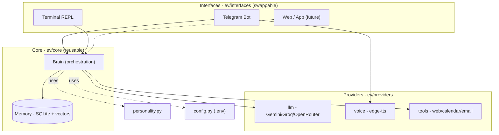
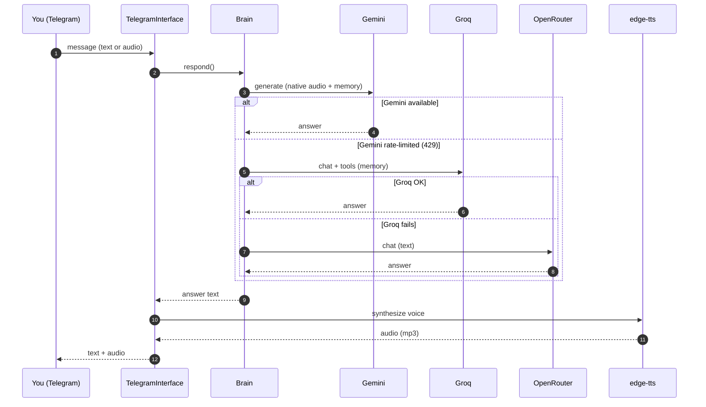

<div align="center">

# E.V.

**A personal AI assistant — voice + mobile, with personality, memory and resilience.**

Inspired by Spider-Man's E.V. (*Brand New Day*): the AI the hero built with his
own hands — loyal, warm, playful, and always on your side.

> **Language note:** this documentation is in English. E.V. **talks to you in
> Brazilian Portuguese** (chat and voice) — that is intentional and configured in
> `ev/personality.py`.

`Python` · `Telegram` · `Gemini + Groq + OpenRouter` · `edge-tts` · `SQLite`

</div>

---

## Features

- **Voice & text chat** — send an audio note, get audio back (natural female voice).
- **Real long-term memory** — remembers you across conversations, with semantic
  (vector) recall of relevant facts.
- **Reminders** — set them in natural language; E.V. fires them at the right time.
- **Real tools** — web search, and (with setup) Google Calendar & email.
- **Personality** — warm and witty, Spider-Man style.
- **Never goes silent** — if one AI provider hits its limit, it falls back to the next.
- **Multiple interfaces** — Telegram (voice + mobile) and a Terminal REPL, sharing
  the exact same brain.

## Architecture

E.V. separates **what she is** (the brain, reusable) from **how you talk to her**
(the interfaces, swappable). New interfaces (terminal, web) reuse the brain unchanged.



### Message flow (with automatic fallback)



> Full design details in **[docs/architecture.md](docs/architecture.md)**.

## Project structure

```
E.V/
├── run_telegram.py          # entry point (Telegram bot)
├── run_terminal.py          # entry point (Terminal REPL)
├── requirements.txt
├── .env.example             # config template (copy to .env)
├── docs/
│   └── architecture.md      # detailed architecture + diagrams
├── deploy/
│   ├── README.md            # Oracle Cloud step-by-step (24/7)
│   └── setup_vm.sh          # installs E.V. as a systemd service
└── ev/
    ├── __init__.py          # injects OS trust store (TLS)
    ├── config.py            # configuration (reads .env)
    ├── personality.py       # the system prompt — who E.V. is (PT-BR)
    ├── core/
    │   ├── brain.py         # orchestrates LLM + memory + tools + fallback
    │   └── memory.py        # SQLite persistence + vector recall
    ├── providers/
    │   ├── llm.py           # Gemini/Groq/OpenRouter + Whisper
    │   ├── embeddings.py    # text embeddings (semantic memory)
    │   ├── voice.py         # text -> speech (edge-tts)
    │   └── tools.py         # web search, calendar, email
    └── interfaces/
        ├── telegram_bot.py  # Telegram adapter (+ reminder scheduler)
        └── terminal.py      # Terminal REPL adapter
```

## AI providers (all free)

| Role | Provider | Model | Why |
|------|----------|-------|-----|
| Primary | **Gemini** | `gemini-flash-latest` | Smart, native audio, saves memory |
| Fallback 1 | **Groq** | `openai/gpt-oss-120b` | Fast, reliable tool calling, saves memory |
| Fallback 2 | **OpenRouter** | `nvidia/nemotron-3-ultra-550b-a55b:free` | "Genius" backstop (1M context) |
| Transcription | **Groq Whisper** | `whisper-large-v3-turbo` | Audio -> text when Gemini is rate-limited |
| Embeddings | **Gemini** | `gemini-embedding-001` | Semantic memory recall |

## Run locally

```bash
python3 -m venv .venv && source .venv/bin/activate
pip install -r requirements.txt
cp .env.example .env      # fill in the keys (see below)

python run_telegram.py    # Telegram bot (voice + mobile)
# or
python run_terminal.py    # Terminal REPL (text)
```

### Required keys (all free)

| Variable | Where to get it |
|----------|-----------------|
| `TELEGRAM_TOKEN` | [@BotFather](https://t.me/BotFather) on Telegram |
| `GEMINI_API_KEY` | https://aistudio.google.com/apikey |
| `GROQ_API_KEY` | https://console.groq.com/keys |
| `OPENROUTER_API_KEY` | https://openrouter.ai/keys |

> Tip: run once, send `/start`, grab your ID from the logs and set `EV_OWNER_ID`
> to lock the bot to yourself.

## Run 24/7 (Oracle Cloud)

See **[deploy/README.md](deploy/README.md)** — runs on an Always Free VM as a
`systemd` service (starts on boot, restarts on crash).

## Roadmap

- [x] Voice & text chat (Telegram)
- [x] Reliable long-term memory (via Groq)
- [x] Multi-provider fallback
- [x] Warm personality + humor
- [x] Reminder scheduler
- [x] Semantic (vector) memory recall
- [x] Web search tool
- [x] Terminal interface
- [ ] Google Calendar & email (needs Google OAuth setup)
- [ ] Web / app interface

---

<div align="center">
Built with care.
</div>
