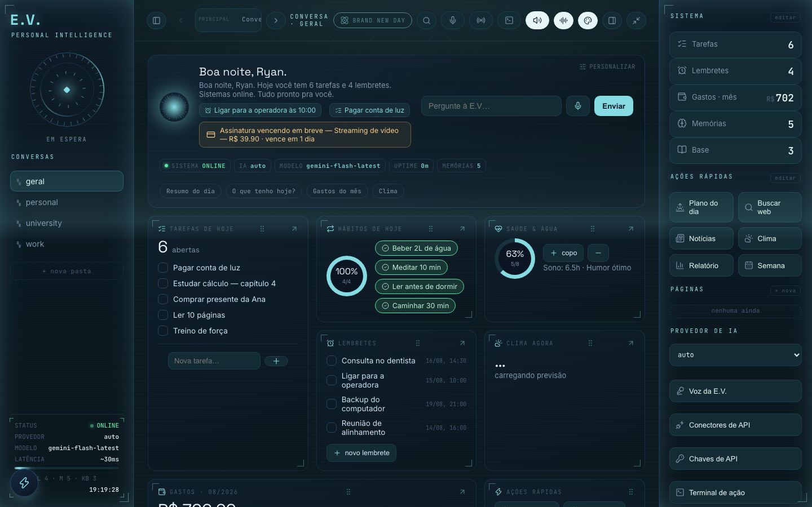
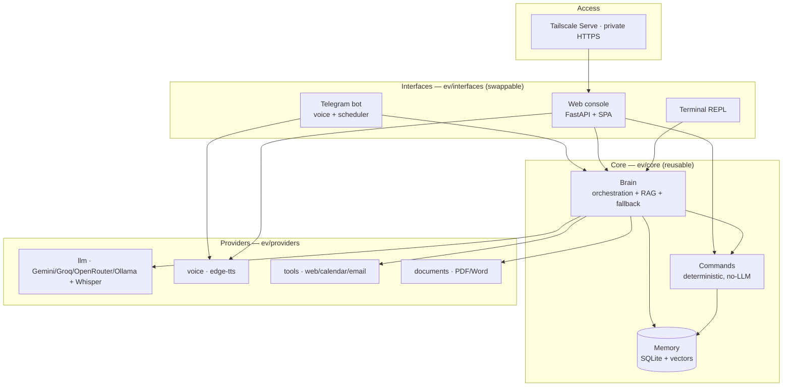
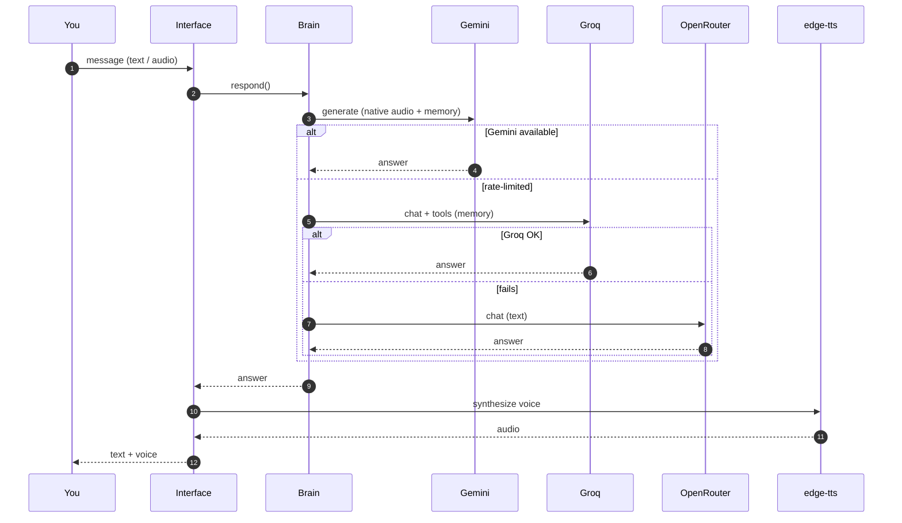

<div align="center">


### A personal AI assistant with a voice, a memory, and a will to never go quiet.

Two doors — **Telegram** and a **JARVIS-style web console** — one mind behind both.
Inspired by Spider-Man's E.V. (*Brand New Day*): the AI the hero built with his own
hands — loyal, warm, playful, and always on your side.

<br/>


[](https://github.com/Ryanditko/E.V/actions/workflows/deploy.yml)

**[Screenshots](#screenshots) · [Features](#what-she-does) · [Quick start](#quick-start) · [Architecture](#architecture) · [Deploy 24/7](#run-her-24-7) · [Docs](#documentation)**

</div>

---

> [!NOTE]
> **This documentation is in English. E.V. talks to you in Brazilian Portuguese** —
> chat and voice — on purpose; her personality lives in `ev/personality.py`.

---

## Screenshots

Every screen in the web console — 24 tabs, the floating action terminal, and three
color themes (default JARVIS blue, **Brand New Day**, and the red-alert **Focus mode**) —
so you can see everything she actually does, not just the highlights.

<div align="center">

**Core — chat, dashboard, terminal**

| Dashboard | Chat |
|---|---|
|  |  |

| Action terminal |
|---|
|  |

**Themes — three looks, one E.V.**

> [!TIP]
> Switch themes from the palette button in the top bar: the default **JARVIS blue**, the
> cinematic aqua **Brand New Day** (inspired by the *Spider-Man: Brand New Day* film UI),
> or the red-alert **Focus mode**. Brand New Day and Focus mode are separate modes — turning
> one on turns the other off.

| Default (JARVIS blue) | Brand New Day | Focus mode |
|---|---|---|
|  |  |  |

**Productivity & routine**

| Tasks | Reminders |
|---|---|
|  |  |

| Calendar | Journal |
|---|---|
|  |  |

| Habits | Health |
|---|---|
|  |  |

**Money**

| Expenses | Subscriptions |
|---|---|
|  |  |

| Budgets | Goals |
|---|---|
|  |  |

**Memory & knowledge**

| Memories | Knowledge base |
|---|---|
|  |  |

| Links | Document vault |
|---|---|
|  |  |

**World & data**

| Map | Mind graph |
|---|---|
|  |  |

| Weather | Music |
|---|---|
|  |  |

| Panel | Charts |
|---|---|
|  |  |

**Automation**

| Web monitors | Activity log |
|---|---|
|  |  |

**On your phone**

| Home | Chat | Tasks |
|---|---|---|
|  |  |  |

| Expenses | Map | Music |
|---|---|---|
|  |  |  |

</div>

*(All data shown is fictional demo content, not a real account.)*

---

## Two doors, one mind

E.V. cleanly separates **what she is** (a reusable brain + memory) from **how you reach
her** (swappable interfaces). Every door drives the exact same brain, so a task you
create by voice on Telegram shows up in the web calendar, and a memory saved on the web
is recalled on the phone.

| | **Telegram** | **Web console** | **Terminal** |
|---|---|---|---|
| Best for | on the go, voice notes | dashboards, data, focus | quick local dev |
| Voice | send audio → audio back | record → Whisper → she speaks | — |
| Reach | anywhere | private, via your Tailscale (`https://ev.<tailnet>.ts.net`) | localhost |

---

## What she does

**Conversation & voice**
- Natural chat with a warm, witty personality; **voice in and out** (she speaks with a
 natural pt-BR voice via `edge-tts`, and transcribes your audio with **Groq Whisper**).
- Multi-provider brain that **never goes silent** — Gemini → Groq → OpenRouter → local
 Ollama; if one is rate-limited, the next answers.

**Memory & knowledge**
- **Real long-term memory** with semantic (vector) recall across conversations.
- **Knowledge base (RAG)** — drop a PDF/Word/web page; she indexes it and answers grounded
 in it, with the original file available to open or download.
- **Vision / OCR** — send a photo (a bill, a screenshot) and she reads it.

**Life, organized**
- Tasks (with **due dates + rolling recurrence**), reminders & a calendar (**daily/weekly/
 monthly recurrence**), expenses with budgets & alerts, habits with streaks, journal,
 links by category, subscriptions, and web/price monitors — full CRUD on every one.
- **Daily briefing**, weekly review, monthly financial report, proactive check-ins,
 weather & news, Pomodoro, and AI insights.

**Real tools & reach**
- Web search (**Tavily → Brave → DuckDuckGo**), web-page indexing, document generation
 (PDF/Word), **Spotify** playback control (web console), and — with setup — **Google
 Calendar & Gmail**.
- **Hands-free**: she can *run* any command herself (create/edit/delete) from chat or voice.
- **Owner-locked** to you (`EV_OWNER_ID`) and works in Telegram topic groups on mention.

**Web console extras**
- An **action terminal** shows her thinking → acting → result per step for a command.
- **Focus mode** — a focus-mode visual toggle (red/high-contrast) with a
  persistent header badge.
- Proactive alerts (subscriptions due, budgets over) surface in the notification center;
  a **Cmd/Ctrl+K** searches your actual data, not just views; dashboard cards are
  draggable to reorder.

**Runs like a product**
- **CI/CD** (test-gated auto-deploy), **systemd** services, a **watchdog** that restarts
 and alerts, daily DB backups, and **private HTTPS** with zero open ports.

---

## The web console

A self-contained single-page **JARVIS-style monochrome console** (no build step) served by
FastAPI, backed by the same brain and data as Telegram.

- **Chat** with structured rendering, slash-command autocomplete and a `⌘/Ctrl-K` palette.
- **Voice** — she reads replies aloud, and takes voice input by recording audio and
 transcribing it **server-side with Whisper**, so it works in **any browser** (Firefox,
 Chrome, Safari), not just Chrome.
- **CRUD tabs** for Tasks, Expenses, Reminders, Calendar, Memories, Links, Habits, Journal,
 Subscriptions, Budgets and Monitors — create / **edit** / delete, per-tab search,
 recurrence, drag-and-drop, clickable links, PDF/Word open & download.
- Customizable quick-actions & system panels, Pomodoro, API-key manager, in-app modals,
 fully responsive.

**Private HTTPS, no open ports.** It's exposed over **Tailscale Serve** at
`https://ev.<tailnet>.ts.net` — a valid TLS cert, reachable **only** from your own
Tailscale devices, with nothing opened on the cloud firewall. The app itself binds to
`127.0.0.1`. Full runbook: **[deploy/HTTPS_TAILSCALE.md](deploy/HTTPS_TAILSCALE.md)**
(Cloudflare Tunnel alternative in [deploy/HTTPS_CLOUDFLARE.md](deploy/HTTPS_CLOUDFLARE.md)).
More: **[docs/WEB.md](docs/WEB.md)**.

---

## Quick start

**Requirements:** Python 3.11+ and `git`. That's it — everything else the installer sets up.

> [!TIP]
> **Fastest path — one command.** The friendly installer checks Python, creates the venv,
> installs deps and fills in your `.env` interactively. You only need the **two required
> keys** (both free, no card): a Telegram bot token and a Gemini key.

```bash
git clone https://github.com/Ryanditko/E.V.git ev && cd ev && bash install.sh
```

Non-interactive (CI / scripted) — pass the keys as env vars and it won't prompt:

```bash
TELEGRAM_TOKEN=... GEMINI_API_KEY=... bash install.sh
```

It never overwrites an existing `.env`. Prefer to wire things up by hand? Follow the
manual steps below. Either way, the full first-machine walkthrough (every key, Google
auth, deploy) lives in **[docs/SETUP.md](docs/SETUP.md)**.

### Manual

```bash
python3 -m venv .venv && source .venv/bin/activate
pip install -r requirements.txt
cp .env.example .env          # fill in your keys (below)

python run_telegram.py        # Telegram bot (voice + mobile)
python run_web.py             # web console at http://localhost:8000
python run_terminal.py        # terminal REPL
# or: bash start.sh
```

### Keys (all free)

Every variable and cost is in **[docs/KEYS.md](docs/KEYS.md)**. The essentials:

| Variable | Where | |
|----------|-------|---|
| `TELEGRAM_TOKEN` | [@BotFather](https://t.me/BotFather) | **required** |
| `GEMINI_API_KEY` | https://aistudio.google.com/apikey | **required** |
| `EV_OWNER_ID` | your Telegram ID — locks the bot to you | recommended |
| `GROQ_API_KEY` | https://console.groq.com/keys | optional (fallback + voice) |
| `OPENROUTER_API_KEY` | https://openrouter.ai/keys | optional (fallback) |
| `TAVILY_API_KEY` | https://app.tavily.com | optional (better web search) |
| `EV_WEB_TOKEN` | any long random string | optional (web login) |

> [!IMPORTANT]
> Only **`TELEGRAM_TOKEN`** and **`GEMINI_API_KEY`** are strictly required — everything
> else is optional and just unlocks more. Set **`EV_OWNER_ID`** to your Telegram numeric
> ID to lock the bot to you (send `/start` and read it from the logs).

> [!WARNING]
> Leave `EV_OWNER_ID` **empty** and the bot answers **anyone** who messages it. Set it
> before you share the bot's username. Likewise, only enable the web console with a
> **long, random `EV_WEB_TOKEN`** — it's the key to your data.

> [!CAUTION]
> Never commit secrets. `.env`, `client_secret*.json`, `google_token*.json` and `*.db`
> are git-ignored for a reason — keep them that way and never paste them anywhere public.

---

## ⌨ Commands (deterministic, no LLM, zero tokens)

Type `/` for autocomplete, or `/menu` for a button UI. A taste:

| Command | Example |
|---------|---------|
| `/remind <time> <text>` | `/remind tomorrow 09:00 meeting` |
| `/routine <daily\|weekly\|monthly> …` | recurring reminder |
| `/task <text>` · `/tasks` · `/complete <id>` | to-do list (due dates + recurrence) |
| `/expense <v> <desc> #cat` · `/expenses` · `/report` | expenses & **current-month** report |
| `/budget <cat> <v>` · `/budgets` | budgets with 80/100% alerts |
| `/habit` · `/done` · `/journal` | habits (streaks) & journal |
| `/remember <fact>` · `/memories` · `/find <q>` | memory + unified search |
| `/kb` · `/kbweb <url>` · `/quiz` | knowledge base (send a PDF) + RAG quiz |
| `/gcal` · `/event` · `/email` | Google (after setup) |
| `/pomodoro` · `/document` · `/export` · `/data` | Pomodoro · docs · exports · data control |

Time formats: `10m`, `2h`, `1d`, `today 18:00`, `tomorrow 09:00`, `25/12 14:30`.
Portuguese command names (e.g. `/lembrete`, `/tarefa`) also work.

> [!NOTE]
> Integrations like **Google** (Calendar + Gmail) and **Spotify** are **opt-in** — they
> stay dormant until you add their keys and run the one-time OAuth. Everything else works
> without them. See **[docs/KEYS.md](docs/KEYS.md)** for what each one unlocks.

---

## AI providers (all free tiers)

| Role | Provider | Model | Why |
|------|----------|-------|-----|
| Primary | **Gemini** | `gemini-flash-latest` | Smart, native audio, saves memory |
| Fallback 1 | **Groq** | `openai/gpt-oss-120b` | Fast, reliable tool calling — the workhorse |
| Fallback 2 | **OpenRouter** | `nemotron` (free) | Big-context text backstop |
| Fallback 3 | **Ollama (local)** | `llama3.1` | Never runs out of quota |
| Transcription | **Groq Whisper** | `whisper-large-v3-turbo` | Voice → text (Telegram + web) |
| Embeddings | **Gemini / Ollama** | `gemini-embedding-001` | Semantic memory + knowledge base |

Switch or force a provider at runtime with `/provider` and `/model`.

> [!TIP]
> Add a **local Ollama** model (`ollama pull llama3.1`) and E.V. **never runs out of
> quota** — when every cloud provider is rate-limited, she falls back to your own machine.
> It's optional, but it's the difference between "she went quiet" and "she never does".

---

## Architecture

One core, many doors. New interfaces reuse the brain unchanged.



<details>
<summary><b>Message flow with automatic fallback</b></summary>


</details>

> Deep dive: **[docs/architecture.md](docs/architecture.md)** · extend her: **[docs/EXTENDING.md](docs/EXTENDING.md)**

---

## Run her 24/7

She's built to run like a product:

- **One-command deploy** — `bash deploy.sh` ships code + keys to the VM and restarts.
- **CI/CD** — push to `main` runs the **pytest gate**, then auto-deploys and restarts both
 services (`.github/workflows/deploy.yml`).
- **systemd** — `ev` (Telegram) and `ev-web` (web) auto-start on boot, restart on crash.
- **Watchdog** — every ~15 min, checks both services, restarts if down, alerts you on
 Telegram; also warns on low disk/memory (`.github/workflows/watchdog.yml`).
- **Backups** — the DB is sent to you on Telegram (weekly + first run).
- **Fresh VM** — `bash deploy/setup_vm.sh` installs both services in one go.

Hosting options — pick a machine that stays on:

- **Free, your hardware:** Android via Termux (**[docs/TERMUX.md](docs/TERMUX.md)**) · your
 PC as a service (**[docs/SELF_HOST.md](docs/SELF_HOST.md)**).
- **Cloud, always on:** Oracle Always Free (**[docs/DEPLOY.md](docs/DEPLOY.md)**).

---

## Project structure

```
E.V/
├── run_telegram.py · run_web.py · run_terminal.py   # entry points
├── start.sh · deploy.sh                             # local run · ship to VM
├── requirements.txt · .env.example
├── ev/
│   ├── config.py            # configuration (.env)
│   ├── personality.py       # who E.V. is (PT-BR system prompt)
│   ├── core/
│   │   ├── brain/          # LLM + memory + tools + RAG + fallback (mixin package)
│   │   ├── memory/         # SQLite: messages, facts, reminders, tasks, KB… (mixin package)
│   │   ├── commands/       # deterministic slash commands, no LLM (mixin package)
│   │   ├── knowledge.py     # PDF/Word/web ingestion + chunking
│   │   ├── timeparse.py     # natural-time + month-boundary helpers
│   │   └── health.py        # system + provider health checks
│   ├── providers/
│   │   ├── llm.py           # Gemini/Groq/OpenRouter/Ollama + Whisper
│   │   ├── embeddings.py    # semantic embeddings
│   │   ├── voice.py         # text → speech (edge-tts)
│   │   ├── tools/          # web search, weather, maps, calendar, email (package)
│   │   └── documents.py     # PDF/Word generation
│   └── interfaces/
│       ├── telegram_bot/   # Telegram adapter + scheduler + automations (mixin package)
│       ├── web/            # FastAPI server + single-page console (router package)
│       └── terminal.py      # terminal REPL
├── deploy/                  # setup_vm.sh · watchdog.sh · HTTPS runbooks
├── docs/                    # full documentation (index below)
└── tests/                   # 186 tests
```

---

## Testing

```bash
./.venv/bin/python -m pytest -q      # 186 passing
```

CI runs the suite as a **gate before every deploy** — a red test never ships.

---

## Documentation

| Doc | What's inside |
|-----|---------------|
| [docs/SETUP.md](docs/SETUP.md) | First-machine walkthrough (keys, Google, deploy) |
| [docs/KEYS.md](docs/KEYS.md) | Every service, variable and cost |
| [docs/WEB.md](docs/WEB.md) | The web console, endpoints, voice, HTTPS |
| [docs/architecture.md](docs/architecture.md) | Design & diagrams |
| [docs/STACK.md](docs/STACK.md) | Every tool, library & service used |
| [docs/CAPABILITIES.md](docs/CAPABILITIES.md) | Full capability reference |
| [docs/EXTENDING.md](docs/EXTENDING.md) | Add features (yourself or with an AI) |
| [docs/DEPLOY.md](docs/DEPLOY.md) · [docs/SELF_HOST.md](docs/SELF_HOST.md) · [docs/TERMUX.md](docs/TERMUX.md) | Hosting 24/7 |
| [deploy/HTTPS_TAILSCALE.md](deploy/HTTPS_TAILSCALE.md) · [deploy/HTTPS_CLOUDFLARE.md](deploy/HTTPS_CLOUDFLARE.md) | Private HTTPS |
| [docs/GOOGLE.md](docs/GOOGLE.md) · [docs/GROUPS.md](docs/GROUPS.md) | Google auth · Telegram groups |
| [docs/TROUBLESHOOTING.md](docs/TROUBLESHOOTING.md) | Runbook when something breaks |

---

## Security

- **Owner-locked** to your Telegram ID; the web is behind a bearer token **and** your
 private Tailscale — not on the public internet, with plain HTTP closed.
- Secrets live only in the VM `.env` (git-ignored) and GitHub Actions secrets — never in
 the repo. The watchdog reads the Telegram token from the VM, so no token leaves it.

---

## Built with

`Python 3` · `FastAPI` + `uvicorn` · `python-telegram-bot` · `SQLite` · `edge-tts` ·
`Gemini TTS` · `Groq Whisper` · `Google Gemini` · `Groq` · `OpenRouter` · `Ollama` ·
`pypdf` · `python-docx` · `reportlab` · `Tavily/Brave/DuckDuckGo` · `Spotify Web API` +
`Web Playback SDK` · `Tailscale` · `systemd` · `GitHub Actions` · `Lucide` · `pytest`

---

<div align="center">

**Built by [Ryan](https://github.com/Ryanditko) — one core, many doors.**

</div>
