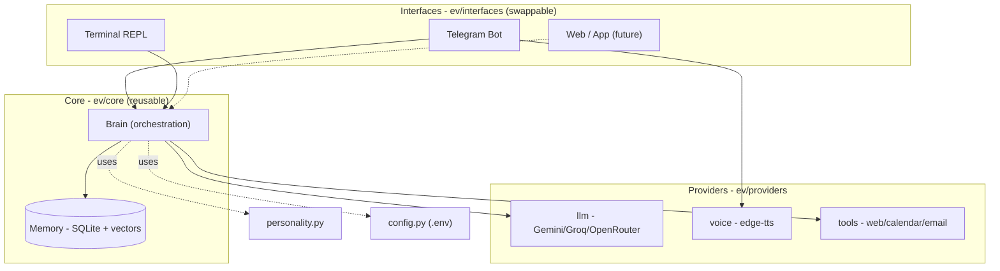
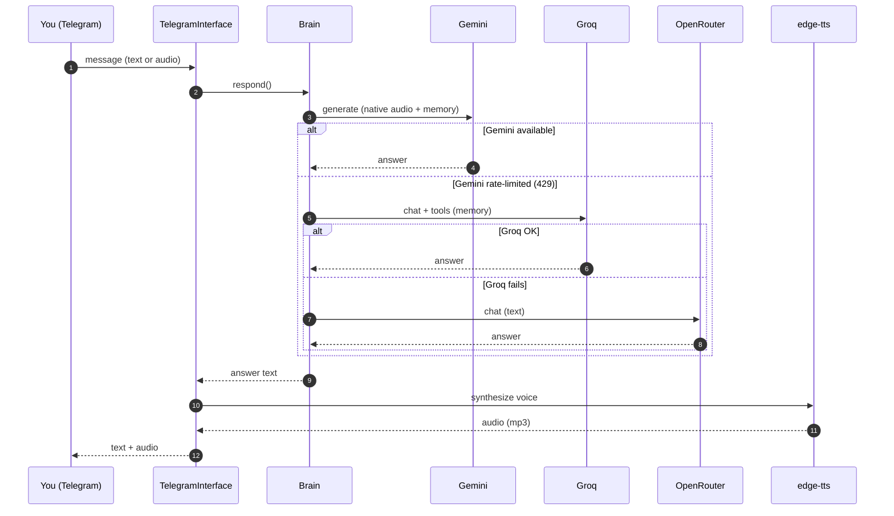

<div align="center">

# E.V.

**A personal AI assistant — voice + mobile, with personality, memory and resilience.**

Inspired by Spider-Man's E.V. (*Brand New Day*): the AI the hero built with his
own hands — loyal, warm, playful, and always on your side.

> **Language note:** this documentation is in English. E.V. **talks to you in
> Brazilian Portuguese** (chat and voice) — that is intentional and configured in
> `ev/personality.py`.

`Python` · `Telegram` · `Gemini + Groq + OpenRouter` · `edge-tts` · `SQLite`

</div>

---

## Features

- **Voice & text chat** — send an audio note, get audio back (natural female voice).
- **Interactive menu** — `/menu` opens a button-driven UI (tap through Tasks,
  Reminders, Links, Knowledge base, Memory, Google) — no need to memorize commands.
- **Slash commands (no LLM)** — fast, deterministic commands for reminders, tasks,
  links, knowledge base, calendar and email. No tokens spent.
- **Real long-term memory** — remembers you across conversations, with semantic
  (vector) recall of relevant facts.
- **Named links** — save links by category (e.g. `faculdade`, `trabalho`).
- **Knowledge base (PDF)** — upload PDFs; E.V. indexes them and answers grounded
  in your documents (RAG).
- **Reminders** — set them in natural language; E.V. fires them at the right time.
- **Daily briefing** — every morning she sends a summary (tasks, reminders, agenda).
- **Vision** — send a photo (a document, a screenshot, a bill) and E.V. reads it.
- **Real tools** — web search, web-page indexing, and (with setup) Google Calendar & email.
- **Owner lock** — set `EV_OWNER_ID` so only you can use the bot.
- **Personality** — warm and witty, Spider-Man style.
- **Never goes silent** — cloud providers fall back to each other, and finally to a
  **local Ollama model** that never runs out of quota.
- **Multiple interfaces** — Telegram (voice + mobile) and a Terminal REPL, sharing
  the exact same brain.

## Architecture

E.V. separates **what she is** (the brain, reusable) from **how you talk to her**
(the interfaces, swappable). New interfaces (terminal, web) reuse the brain unchanged.



### Message flow (with automatic fallback)



> Full design details in **[docs/architecture.md](docs/architecture.md)**.
> Want to add features (yourself or with any AI assistant)? See
> **[docs/EXTENDING.md](docs/EXTENDING.md)**.

## Project structure

```
E.V/
├── run_telegram.py          # entry point (Telegram bot)
├── run_terminal.py          # entry point (Terminal REPL)
├── requirements.txt
├── .env.example             # config template (copy to .env)
├── docs/
│   └── architecture.md      # detailed architecture + diagrams
├── deploy/
│   ├── README.md            # Oracle Cloud step-by-step (24/7)
│   └── setup_vm.sh          # installs E.V. as a systemd service
└── ev/
    ├── __init__.py          # injects OS trust store (TLS)
    ├── config.py            # configuration (reads .env)
    ├── personality.py       # the system prompt — who E.V. is (PT-BR)
    ├── core/
    │   ├── brain.py         # orchestrates LLM + memory + tools + RAG + fallback
    │   ├── memory.py        # SQLite: messages, facts, reminders, tasks, links, KB
    │   ├── commands.py      # deterministic slash commands (no LLM)
    │   ├── timeparse.py     # natural-time parser for commands
    │   └── knowledge.py     # PDF ingestion + chunking (knowledge base)
    ├── providers/
    │   ├── llm.py           # Gemini/Groq/OpenRouter/Ollama + Whisper
    │   ├── embeddings.py    # text embeddings (Gemini or Ollama)
    │   ├── voice.py         # text -> speech (edge-tts)
    │   └── tools.py         # web search, calendar, email
    └── interfaces/
        ├── telegram_bot.py  # Telegram adapter (+ commands, scheduler, PDF upload)
        └── terminal.py      # Terminal REPL adapter
```

## AI providers (all free)

| Role | Provider | Model | Why |
|------|----------|-------|-----|
| Primary | **Gemini** | `gemini-flash-latest` | Smart, native audio, saves memory |
| Fallback 1 | **Groq** | `openai/gpt-oss-120b` | Fast, reliable tool calling, saves memory |
| Fallback 2 | **OpenRouter** | `nvidia/nemotron-3-ultra-550b-a55b:free` | "Genius" backstop (1M context) |
| Fallback 3 | **Ollama (local)** | `llama3.1` | Never runs out of quota (runs on your machine) |
| Transcription | **Groq Whisper** | `whisper-large-v3-turbo` | Audio -> text when Gemini is rate-limited |
| Embeddings | **Gemini / Ollama** | `gemini-embedding-001` / `nomic-embed-text` | Semantic memory + knowledge base |

## Interactive menu & slash commands (no LLM)

Send `/menu` for a button-driven interface, or type `/` to see all commands. Both
run instantly, without spending tokens:

| Command | Example |
|---------|---------|
| `/lembrete <time> <text>` | `/lembrete 10m tomar água`, `/lembrete amanhã 09:00 reunião` |
| `/rotina <diario\|semanal> <HH:MM> <text>` | recurring reminder |
| `/lembretes` · `/cancelar <id>` | list / cancel reminders |
| `/tarefa <text>` · `/tarefas` · `/concluir <id>` | to-do list |
| `/lembrar <fact>` · `/memorias` | save/list long-term memory |
| `/link <cat> \| <name> \| <url>` · `/links [cat]` · `/linkrm <id>` | named links by category |
| `/kb` · `/kbweb <url>` · `/kbrm <name>` | knowledge base (send a PDF, or index a web page) |
| `/agenda` · `/evento <time> <title>` · `/email <to> \| <subj> \| <body>` | Google (after setup) |
| `/ajuda` | list everything |

Accepted time formats: `10m`, `2h`, `1d`, `hoje 18:00`, `amanhã 09:00`, `25/12 14:30`.
Send a **PDF** to add it to the knowledge base, or a **photo** for E.V. to read it.

## Run locally

> New machine or full walkthrough (every key, Google auth, deploy)? See
> **[docs/SETUP.md](docs/SETUP.md)**.

```bash
python3 -m venv .venv && source .venv/bin/activate
pip install -r requirements.txt
cp .env.example .env      # fill in the keys (see below)

python run_telegram.py    # Telegram bot (voice + mobile)
# or
python run_terminal.py    # Terminal REPL (text)
```

### Keys

Every service, link, `.env` variable and cost is listed in **[docs/KEYS.md](docs/KEYS.md)**.
The essentials (all free):

| Variable | Where to get it |
|----------|-----------------|
| `TELEGRAM_TOKEN` | [@BotFather](https://t.me/BotFather) on Telegram |
| `GEMINI_API_KEY` | https://aistudio.google.com/apikey |
| `GROQ_API_KEY` | https://console.groq.com/keys |
| `OPENROUTER_API_KEY` | https://openrouter.ai/keys |
| `TAVILY_API_KEY` | https://app.tavily.com (better web search) |

> Tip: run once, send `/start`, grab your ID from the logs and set `EV_OWNER_ID`
> to lock the bot to yourself.

## One-command scripts

- **`bash start.sh`** — run E.V. locally (sets up venv, deps, checks `.env`, starts).
- **`bash deploy.sh`** — ship code + your keys to the VM and (re)start it, in one command.

## Keep it online 24/7

Pick a host — the bot needs some machine left running:

- **No credit card — your own hardware:**
  - Android phone via Termux: **[docs/TERMUX.md](docs/TERMUX.md)**
  - Your PC as a background service (macOS/Linux/Windows): **[docs/SELF_HOST.md](docs/SELF_HOST.md)**
- **Cloud, always on (needs a card for signup):** Oracle Always Free —
  **[docs/DEPLOY.md](docs/DEPLOY.md)** (also runs Ollama for the never-runs-out fallback).

## Roadmap

- [x] Voice & text chat (Telegram)
- [x] Reliable long-term memory (via Groq)
- [x] Multi-provider fallback
- [x] Warm personality + humor
- [x] Reminder scheduler
- [x] Semantic (vector) memory recall
- [x] Web search tool
- [x] Terminal interface
- [x] Deterministic slash commands (no LLM)
- [x] Named links by category
- [x] Knowledge base (PDF upload + RAG)
- [x] Local model fallback (Ollama, never runs out)
- [x] Interactive button menu
- [x] Daily briefing
- [x] Vision (photo understanding)
- [x] Web-page indexing into the knowledge base
- [x] Automated tests
- [x] Recurring reminders (`/rotina`) and cancel (`/cancelar`)
- [x] Automatic daily DB backups
- [x] Long-message splitting + global error handler
- [ ] Google Calendar & email (needs Google OAuth setup)
- [ ] Web / app interface

---

<div align="center">
Built with care.
</div>
