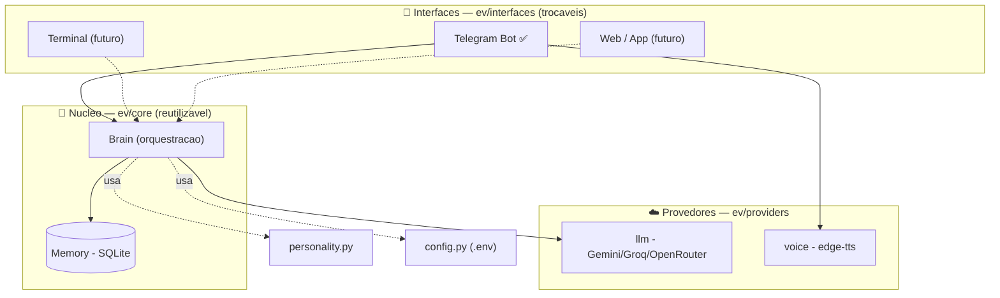
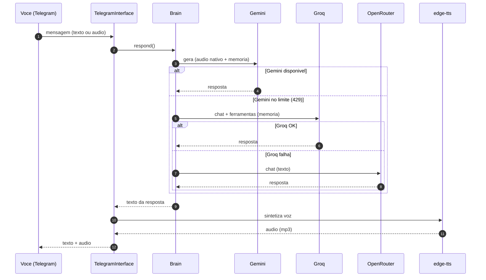

<div align="center">

# 🕷️ E.V.

**Assistente pessoal de IA — voz + celular, com personalidade, memória e resiliência.**

Inspirada na E.V. do Homem-Aranha (*Brand New Day*): a IA que o herói construiu
com as próprias mãos — leal, meiga, brincalhona e sempre do seu lado.

`Python` · `Telegram` · `Gemini + Groq + OpenRouter` · `edge-tts` · `SQLite`

</div>

---

## ✨ O que ela faz

- 🗣️ **Conversa por voz e texto** — manda áudio, recebe áudio (voz feminina natural).
- 🧠 **Memória de verdade** — lembra de você entre conversas (nome, gostos, rotinas).
- 😄 **Personalidade** — carinhosa e com piadas no estilo Homem-Aranha.
- 🛡️ **Nunca fica muda** — se um provedor de IA bate no limite, cai automaticamente no próximo.
- 📱 **No celular hoje** (Telegram), com o cérebro pronto pra terminal/web amanhã.

## 🏗️ Arquitetura

O projeto separa **o que a E.V. é** (o cérebro, reutilizável) de **como você fala com ela**
(as interfaces, trocáveis). Isso permite evoluir pra terminal/web sem reescrever a lógica.



### Fluxo de uma mensagem (com fallback automático)



> Detalhes completos (decisões de projeto, camadas, memória, TLS corporativo) em
> **[docs/architecture.md](docs/architecture.md)**.

## 📁 Estrutura do projeto

```
E.V/
├── run_telegram.py          # ponto de entrada (sobe o bot)
├── requirements.txt
├── .env.example             # modelo de configuração (copie p/ .env)
├── docs/
│   └── architecture.md      # arquitetura detalhada + diagramas
├── deploy/
│   ├── README.md            # passo a passo Oracle Cloud (24/7)
│   └── setup_vm.sh          # instala a E.V. como serviço na VM
└── ev/
    ├── __init__.py          # injeta trust store do SO (TLS)
    ├── config.py            # configuração (lê o .env)
    ├── personality.py       # o system prompt — quem a E.V. é
    ├── core/
    │   ├── brain.py         # orquestra LLM + memória + fallback
    │   └── memory.py        # persistência SQLite (conversa/fatos/lembretes)
    ├── providers/
    │   ├── llm.py           # Gemini/Groq/OpenRouter + Whisper
    │   └── voice.py         # texto → voz (edge-tts)
    └── interfaces/
        └── telegram_bot.py  # a "casca" do Telegram
```

## 🧩 Provedores de IA (todos grátis)

| Papel | Provedor | Modelo | Por quê |
|-------|----------|--------|---------|
| Principal | **Gemini** | `gemini-flash-latest` | Esperto, ouve áudio nativo, salva memória |
| Fallback 1 | **Groq** | `llama-3.3-70b-versatile` | Rápido (30/min), salva memória, sempre disponível |
| Fallback 2 | **OpenRouter** | `nvidia/nemotron-3-ultra-550b-a55b:free` | Backstop "genião" (1M contexto) |
| Transcrição | **Groq Whisper** | `whisper-large-v3-turbo` | Áudio → texto quando o Gemini está no limite |

## 🚀 Rodar localmente

```bash
python3 -m venv .venv && source .venv/bin/activate
pip install -r requirements.txt
cp .env.example .env      # preencha as chaves (veja abaixo)
python run_telegram.py
```

### Chaves necessárias (todas grátis)

| Variável | Onde pegar |
|----------|------------|
| `TELEGRAM_TOKEN` | [@BotFather](https://t.me/BotFather) no Telegram |
| `GEMINI_API_KEY` | https://aistudio.google.com/apikey |
| `GROQ_API_KEY` | https://console.groq.com/keys |
| `OPENROUTER_API_KEY` | https://openrouter.ai/keys |

> Dica: rode uma vez, mande `/start`, pegue seu ID nos logs e ponha em `EV_OWNER_ID`
> pra travar o bot só pra você.

## ☁️ Rodar 24/7 (Oracle Cloud)

Veja **[deploy/README.md](deploy/README.md)** — sobe numa VM Always Free como serviço
`systemd` (liga no boot, reinicia sozinha).

## 🗺️ Roadmap

- [x] Conversa por voz e texto (Telegram)
- [x] Memória de longo prazo (confiável via Groq)
- [x] Fallback multi-provedor
- [x] Personalidade meiga + humor
- [ ] Disparo de lembretes na hora certa (agendador)
- [ ] Ferramentas reais: agenda, e-mail, busca na web
- [ ] Interface de terminal (reusa o cérebro)
- [ ] Memória com busca vetorial (embeddings)

---

<div align="center">
Feito com 🕸️ e café.
</div>
