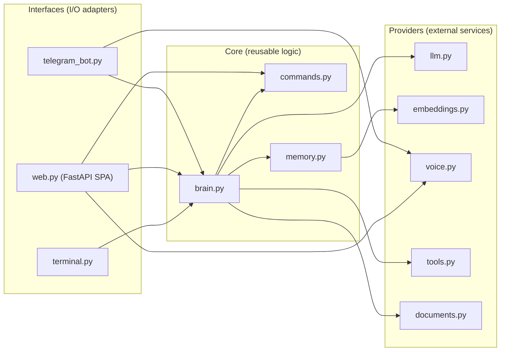
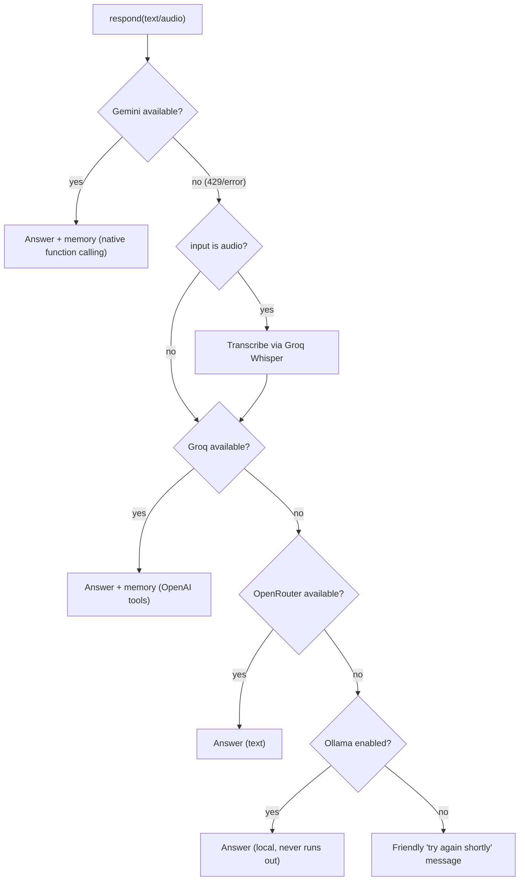
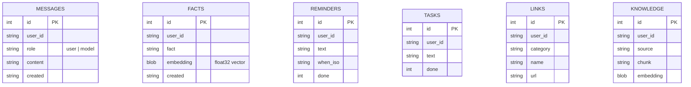
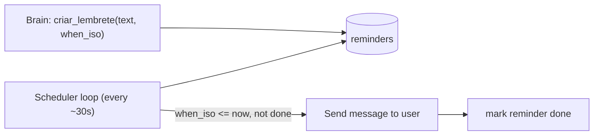

# E.V. — Architecture

This document details the design decisions. For the overview, see the
[README](../README.md).

> Language: docs are in English; E.V. converses in Brazilian Portuguese
> (see `ev/personality.py`).

## Core principle: brain decoupled from interface

E.V. is split into **layers** with a strict dependency rule: outer layers know
about inner ones, never the reverse.

- **Interfaces** (`ev/interfaces`): receive input and deliver output — **Telegram**,
  the **web console** (`web.py`, FastAPI serving a single-page app), and **Terminal**.
  They only call `Brain.respond()` (and `Commands.run()` for deterministic actions).
- **Core** (`ev/core`): `Brain` orchestrates; `Memory` holds state. They know
  nothing about Telegram or HTTP.
- **Providers** (`ev/providers`): talk to external services (LLMs, embeddings,
  TTS, tools).
- **Cross-cutting**: `config.py` (reads `.env`) and `personality.py` (the system
  prompt).

Adding an interface = writing a new adapter that calls `Brain.respond()`. Zero
changes to the core.

## Multi-provider strategy (resilience)

Each provider's free tier is limited. Instead of relying on one, E.V. chains
providers and **falls through to the next** when one fails (rate limit, error).

The final fallback is a **local Ollama model** — no quota, so E.V. keeps working
even if every cloud provider is exhausted. It needs Ollama installed with a model
pulled; on a headless deploy, use a VM with enough RAM (e.g. Oracle's free ARM).

### Why Gemini is primary
It is multimodal (**hears audio natively**, no transcription step) and strong in
Portuguese. When available, it's the best path.

### Why memory also lives in Groq
In practice, Gemini's free tier can be nearly exhausted (tiny daily quotas).
Saving memory needs *function calling*, and Groq supports it too (OpenAI-compatible
API), so we replicate the tools there. Memory is therefore **reliable** even
without Gemini. OpenRouter is a plain-text backstop (no memory) — the last line
before asking the user to retry.

### Tool-calling resilience
Open models (Llama) sometimes format a tool call invalidly (`tool_use_failed`).
In that case Groq **answers without tools** instead of failing the turn — E.V.
always replies something.

## Memory (SQLite + vectors)

A single `ev_memory.db` file, plus in-process vector search over facts.

- **messages**: recent conversation history (turn context).
- **facts**: long-term memory. Each fact stores an **embedding**; on each turn,
  E.V. retrieves the top-K facts most semantically similar to the current message
  (cosine similarity, computed in Python) and injects them into the system prompt.
  Falls back to "all facts" if embeddings are unavailable.
- **reminders**: reminders. A background scheduler polls for due ones and delivers
  them.

Brute-force cosine over a personal-scale fact set is more than fast enough; no
external vector DB needed.

## Reminder scheduler

The current date/time is injected into the system prompt so the model can turn
"tomorrow at 9am" into an absolute ISO 8601 timestamp. The Telegram interface runs
the scheduler as a background task and delivers due reminders to the user's chat.

## Tools

Exposed to the model via function calling (`ev/providers/tools.py`):

- **web search** — DuckDuckGo, no API key.
- **calendar / email** — Google APIs; require one-time OAuth setup by the user
  (see `.env.example`). Disabled gracefully when not configured.

## Slash commands (no LLM)

`ev/core/commands.py` implements deterministic commands that never touch the LLM:
reminders, tasks, memory, links (named/categorized), and the knowledge base. The
Telegram interface maps each `/command` to a method; the logic is interface-agnostic
so a terminal/web interface can reuse it. Times are parsed by `ev/core/timeparse.py`
(no model), and the commands are registered in Telegram's native `/` menu.

## Knowledge base (RAG)

Send a PDF in the chat and `ev/core/knowledge.py` extracts the text, splits it into
~1200-char chunks, embeds each (capped per document to protect quota) and stores
them in the `knowledge` table. On every message the brain embeds the query, pulls
the top matching chunks (`memory.search_knowledge`) and injects them into the
system prompt, so answers are grounded in the user's documents.

## Note: TLS behind a corporate proxy

On networks with TLS inspection (a proxy that re-signs certificates with an
internal CA), Python's `certifi` fails (`CERTIFICATE_VERIFY_FAILED`) for some
hosts. E.V. injects the **OS trust store** via `truststore` in `ev/__init__.py`,
before any HTTP client — so it trusts the corporate CA (already in the system)
and works on any network. Outside a corporate proxy, it's harmless.

## Web access & private HTTPS

The web console (`web.py`) runs as its own process/service and binds to
`EV_WEB_HOST:EV_WEB_PORT` (default `127.0.0.1:8000` in production). It is fronted by
**Tailscale Serve**, which terminates TLS with a valid `*.ts.net` certificate and
proxies to the local port — so the UI is reachable at `https://ev.<tailnet>.ts.net`
**only from the owner's Tailscale devices**, with **no ports opened** on the cloud
firewall. HTTPS is what unlocks the browser's secure-context features (microphone/voice,
Picture-in-Picture, notifications). Setup: **[../deploy/HTTPS_TAILSCALE.md](../deploy/HTTPS_TAILSCALE.md)**.

Recurrence note: reminders and calendar events repeat via the scheduler (`recur` =
daily/weekly/monthly); tasks carry a `due` datetime and roll to their next occurrence
on completion or via the `Memory.roll_due_tasks` worker in the reminder loop.

## Configuration

Everything comes from `.env` (via `config.py`). Fallback and tool keys are
**optional**: without them, that provider/tool is simply skipped. See `.env.example`.
