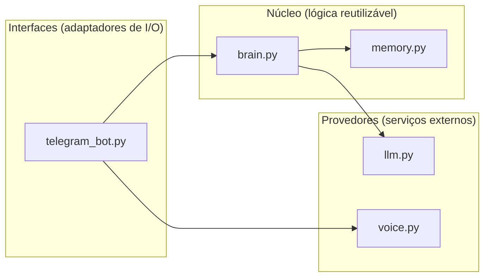
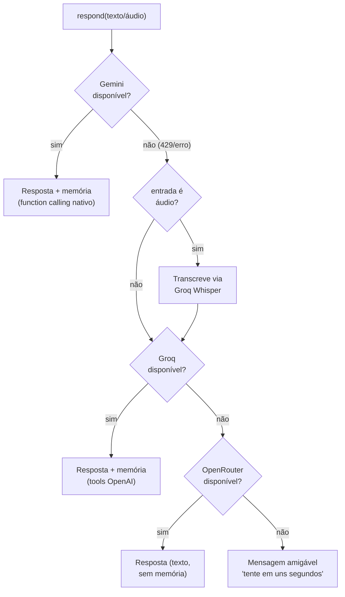
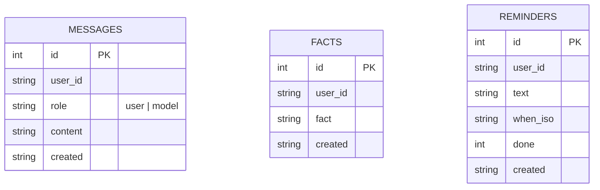

# Arquitetura da E.V.

Este documento detalha as decisões de projeto. Para a visão geral, veja o
[README](../README.md).

## Princípio central: cérebro desacoplado da interface

A E.V. é dividida em **camadas** com uma regra de dependência: as camadas de
fora conhecem as de dentro, nunca o contrário.

- **Interfaces** (`ev/interfaces`): recebem entrada e entregam saída (Telegram
  hoje; terminal/web amanhã). Só sabem chamar `Brain.respond()`.
- **Núcleo** (`ev/core`): `Brain` orquestra; `Memory` guarda estado. Não sabem
  nada de Telegram nem de HTTP.
- **Provedores** (`ev/providers`): falam com serviços externos (LLMs, TTS).
- **Transversais**: `config.py` (lê o `.env`) e `personality.py` (o system prompt).

Trocar de interface (ex.: adicionar um terminal) = escrever um novo adaptador
que chama `Brain.respond()`. Zero mudança no núcleo.

## Estratégia multi-provedor (resiliência)

O free tier de cada provedor é limitado. Em vez de depender de um só, a E.V.
encadeia provedores e **cai no próximo** quando um falha (rate limit, erro).

### Por que o Gemini é o principal
Ele é multimodal (**ouve áudio nativo**, sem passo de transcrição) e tem bom
português. Quando disponível, é o melhor caminho.

### Por que a memória vive também no Groq
Na prática, o free tier do Gemini pode estar quase esgotado (cotas diárias
minúsculas). Como salvar memória exige *function calling*, e o Groq também
suporta isso (API compatível com OpenAI), replicamos as ferramentas lá. Assim
a memória é **confiável** mesmo sem o Gemini. O OpenRouter é backstop de texto
puro (sem memória) — a última linha antes de pedir "tente de novo".

### Resiliência de tool-calling
Modelos abertos (Llama) às vezes formatam a chamada de ferramenta de forma
inválida (`tool_use_failed`). Nesse caso, o Groq **responde sem ferramentas**
em vez de quebrar o turno — a E.V. sempre responde algo.

## Memória (SQLite)

Um único arquivo `ev_memory.db`, três tabelas:

- **messages**: histórico recente da conversa (contexto do turno).
- **facts**: memória de longo prazo (o que a E.V. sabe sobre você). Injetados
  no system prompt a cada resposta.
- **reminders**: lembretes (criação/listagem hoje; disparo agendado no roadmap).

Design simples de propósito — dá pra evoluir pra busca vetorial (embeddings)
sem mudar as interfaces.

## Nota: TLS atrás de proxy corporativo

Em redes com inspeção TLS (proxy que reassina certificados com uma CA interna),
o `certifi` do Python falha (`CERTIFICATE_VERIFY_FAILED`) para alguns hosts.
A E.V. injeta o **trust store do SO** via `truststore` no `ev/__init__.py`,
antes de qualquer cliente HTTP — assim confia na CA corporativa (que já está no
sistema) e funciona em qualquer rede. Fora de proxy corporativo, é inofensivo.

## Configuração

Tudo vem do `.env` (via `config.py`). Chaves de fallback são **opcionais**: sem
elas, aquele provedor é simplesmente ignorado. Veja `.env.example`.
